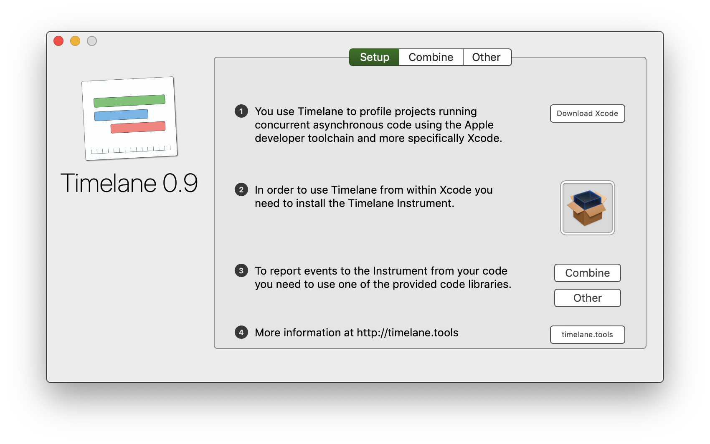

# The Timelane App

**Timelane.app** is your starting point for working with the Timelane Instrument to profile your asynchronous code. It contains the Timelane Instrument installation package and instructions how to get started profiling your code.

You can download the latest release of the app from:
https://github.com/icanzilb/Timelane/releases/latest

# Installation

Unzip and move Timelane.app into your **Applications** folder, then start it up.

Click the package icon to install the Timelane Instrument:

Then follow the instructions in the app or at [timelane.tools](http://timelane.tools) to get started profiling your asynchronous code.

# Demo

The Timelane package contains a demo app at: https://github.com/icanzilb/timelane.

# License

Copyright (c) Marin Todorov 2020
This package is provided under the MIT License.
